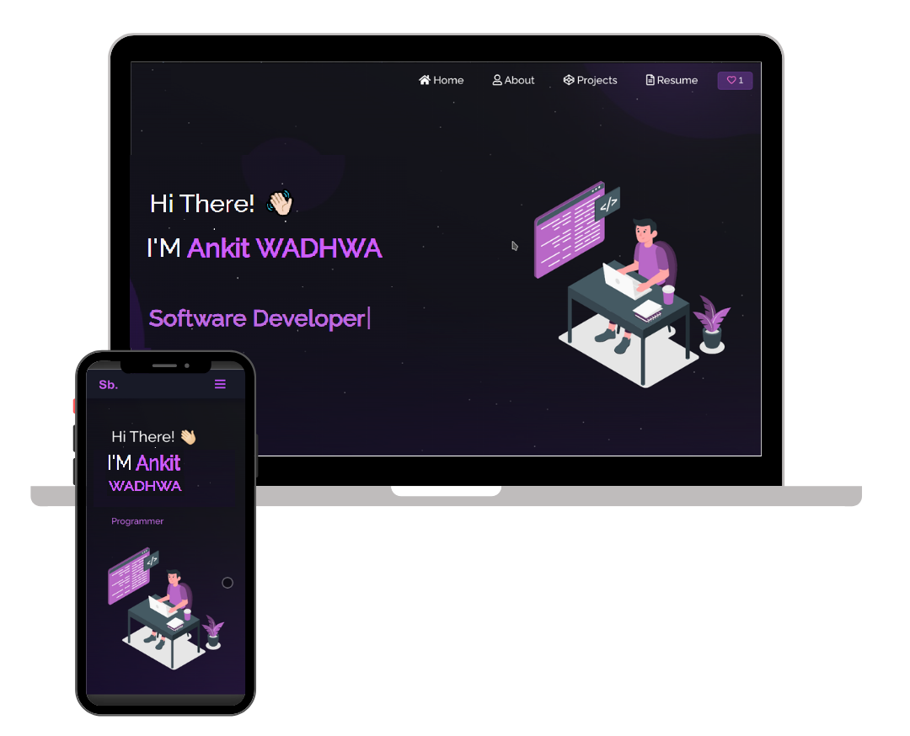

<h2 align="center">
  Portfolio Website - v2.0 
  <a href="https://ankitwadhwa1402.github.io/Portfolio/" target="_parent">Ankit Wadhwa</a>
</h2>

  

 

<h3 align="center">
    🔹
    <a href="https://github.com/Ankitwadhwa1402/Portfolio/issues">Report Bug</a> &nbsp; &nbsp;
    🔹
    <a href="https://github.com/Ankitwadhwa1402/Portfolio/issues">Request Feature</a>
</h3>

## Built With

My personal portfolio <a href="https://ankitwadhwa1402.github.io/Portfolio/" target="_blank">Ankit Wadhwa</a> which features some of my github projects as well as my resume and technical skills. 

This project was built using these technologies.

- React.js
- Node.js
- Express.js
- CSS3
- VsCode
- Vercel

## Features

**📖 Multi-Page Layout**

**🎨 Styled with React-Bootstrap and Css with easy to customize colors**

**📱 Fully Responsive**

## Getting Started

Clone down this repository. You will need `node.js` and `git` installed globally on your machine.
## 🛠 Installation and Setup Instructions

1. Installation: `npm install`

2. In the project directory, you can run: `npm start`

#� �i�n�t�e�r�a�c�t�i�v�e�d�i�a�r�y�
�
�#� �P�o�r�t�f�o�l�i�o�
�
�
